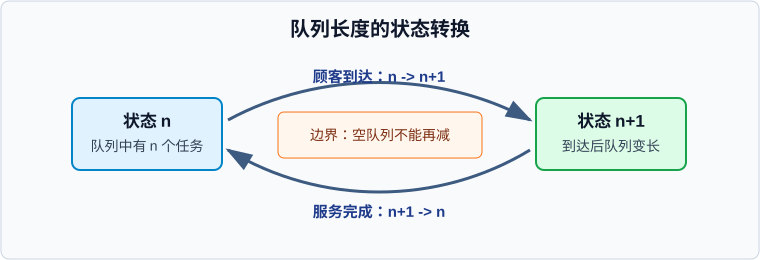

# 示例章：排队系统如何稳定

## 学习目标

- 判断一个简单服务系统是否可能稳定。
- 用公式解释到达率、服务率和利用率之间的关系。
- 通过状态图说明队列长度如何随事件变化。
- 区分"平均很快"和"不会无限积压"这两个判断。

## 开篇问题

一家窗口每分钟平均能处理 12 位顾客，如果平均每分钟只来了 10 位顾客，队伍是不是一定很短？这个问题的陷阱在于：平均服务能力够用，只说明系统有稳定的可能，不保证每一刻都没有拥堵。

## 本章地图

本章先用一个单窗口排队系统建立直觉：顾客到达会让队列变长，服务完成会让队列变短。随后用一个很小的公式把这个直觉压缩成可检查的条件，最后用表格区分几个容易混淆的概念。

## 正文

### 0.1 队列状态由事件推动

队列长度不是连续均匀变化的，而是在两个事件发生时跳变：顾客到达，队列长度加一；服务完成，队列长度减一。如果队列已经为空，服务完成不会让长度变成负数。

> **核心判断**：稳定性的核心不是"永远没有排队"，而是队列长度不会长期向无穷增长。

这个状态图保留了正文最容易吞掉的结构：状态、事件、迁移方向和边界条件。读者不需要先读完整段落，也能扫到系统为什么会积压。

### 0.2 稳定性来自到达率和服务率的比较

设平均到达率为 `lambda`，平均服务率为 `mu`。最基本的负载判断写成：

$$
\rho = \frac{\lambda}{\mu}
$$

| 符号 | 含义 |
|---|---|
| `lambda` | 单位时间内平均到达的任务数 |
| `mu` | 单位时间内平均完成服务的任务数 |
| `rho` | 利用率，也就是到达压力相对服务能力的比例 |

当 `rho < 1` 时，系统有稳定可能；当 `rho >= 1` 时，长期看服务能力追不上到达压力。考试里最容易错的是把 `rho < 1` 读成"队列一定很短"。更准确的说法是：==rho 小于 1 是稳定的必要负载条件，不是低延迟保证==。

### 0.3 三个概念不要混在一起

| 概念 | 判断对象 | 常见误区 |
|---|---|---|
| 服务率 | 系统处理能力 | 把峰值能力当成长期平均能力 |
| 利用率 | 到达压力占服务能力的比例 | 以为利用率越高越好 |
| 稳定性 | 队列是否长期发散 | 以为稳定就等于等待时间短 |

> **易错点**：利用率接近 1 时，系统仍可能满足稳定条件，但等待时间会对波动非常敏感。

### 0.4 用步骤检查一个系统

1. 写出平均到达率 `lambda`。
2. 写出平均服务率 `mu`。
3. 计算 `rho = lambda / mu`。
4. 判断 `rho < 1` 是否成立。
5. 如果成立，再讨论延迟、波动和缓冲空间；如果不成立，先扩容或限流。

## 例题讲解

某系统平均每秒到达 80 个请求，平均每秒能完成 100 个请求。

`rho = 80 / 100 = 0.8`，所以系统从平均负载看有稳定可能。但这不说明每个请求都会很快完成，因为突发到达仍会形成临时队列。

## 常见误区

- 把"平均服务率大于平均到达率"当成"永不排队"。
- 把"系统繁忙"当成"系统不稳定"。高利用率可能稳定，但缓冲和延迟风险会增加。

## 本章小结

排队系统的稳定性来自到达事件和服务完成事件之间的长期平衡。状态图帮助我们保留队列长度的迁移结构，公式帮助我们压缩负载判断，表格帮助我们避免把服务率、利用率和稳定性混为一谈。

## 关键术语

**到达率（arrival rate）** 单位时间内平均进入系统的任务数。

**服务率（service rate）** 单位时间内平均完成服务的任务数。

**利用率（utilization）** 到达压力相对服务能力的比例。

## 练习与解答

1. 一个窗口平均每分钟处理 6 个任务，平均每分钟到达 7 个任务。它能稳定吗？

   **解答**：不能。`rho = 7 / 6 > 1`，长期看到达压力超过服务能力。

2. `rho = 0.95` 是否说明系统体验一定很好？

   **解答**：不能。它只说明平均负载条件可能稳定；接近 1 的利用率会让等待时间对波动更敏感。

## 覆盖记录

-
